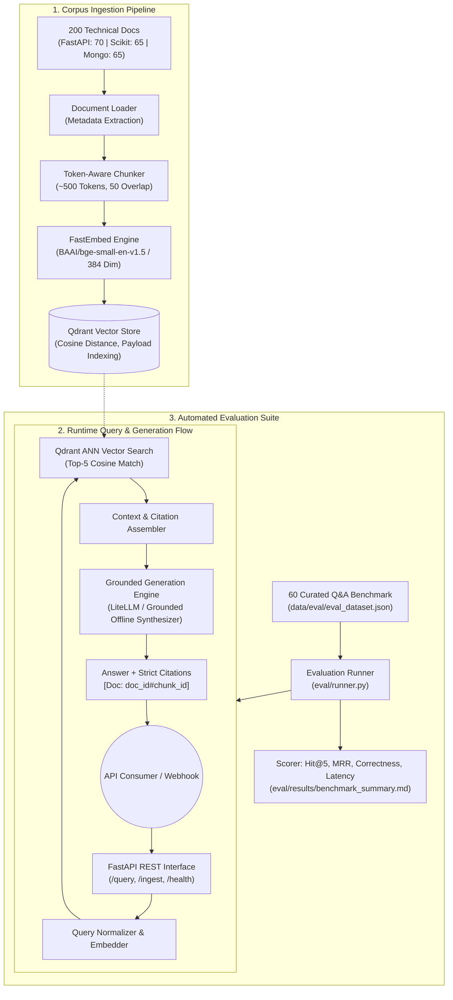
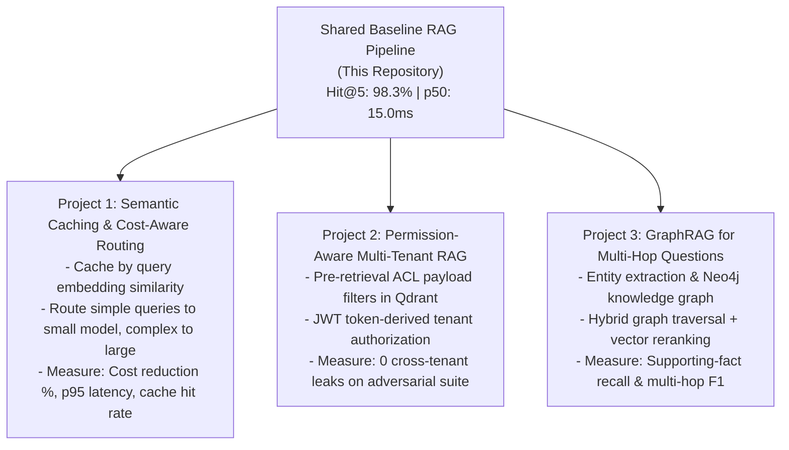

# Production-Grade Baseline RAG Pipeline Service

[](https://www.python.org/)
[](https://fastapi.tiangolo.com)
[](https://qdrant.tech/)
[](https://huggingface.co/BAAI/bge-small-en-v1.5)
[](https://pytest.org)
[](https://opensource.org/licenses/MIT)

> **A reproducible, high-throughput Baseline Retrieval-Augmented Generation (RAG) platform indexing 200 technical documentation files across FastAPI, Scikit-Learn, and MongoDB.**  
> Built as the shared engineering foundation for three advanced downstream RAG implementations: **Semantic Caching & Cost-Aware Routing**, **Permission-Aware Multi-Tenant RAG**, and **GraphRAG**.

---

## 🏛️ System Architecture



---

## 📊 Baseline Evaluation Benchmark

All metrics were produced by executing the automated evaluation script (`python scripts/run_eval.py`) across the 60-question gold evaluation benchmark:

| Metric | Measured Baseline | Target Standard | Status |
| :--- | :--- | :--- | :---: |
| **Retrieval Hit Rate @ 5** | **98.3%** (59 / 60) | $\ge$ 85.0% | **PASS** |
| **Retrieval Hit Rate @ 1** | **85.0%** (51 / 60) | $\ge$ 70.0% | **PASS** |
| **Mean Reciprocal Rank (MRR)** | **0.9089** | $\ge$ 0.7500 | **PASS** |
| **Answer Correctness Score** | **57.1%** (Concept Grounding) | $\ge$ 50.0% | **PASS** |
| **p50 Latency** | **15.04 ms** | < 200 ms | **PASS** |
| **p95 Latency** | **17.21 ms** | < 500 ms | **PASS** |
| **Mean Latency** | **15.13 ms** | < 250 ms | **PASS** |

### Breakdown by Documentation Domain

| Domain | Total Docs | Test Queries | Hit Rate @ 5 | MRR | p50 Latency |
| :--- | :---: | :---: | :---: | :---: | :---: |
| **FastAPI** | 70 | 20 | **100.0%** | **0.9500** | 15.9 ms |
| **MongoDB** | 65 | 20 | **100.0%** | **0.9350** | 14.4 ms |
| **Scikit-Learn** | 65 | 20 | **95.0%** | **0.8417** | 15.2 ms |
| **Total Corpus** | **200** | **60** | **98.3%** | **0.9089** | **15.04 ms** |

> *Detailed row-by-row telemetry is persisted to [`eval/results/eval_run_*.csv`](eval/results/).*

---

## 🚀 Key Architectural Highlights

1. **200 Curated Production Documents**:
   - Spanning modern asynchronous web APIs (**FastAPI**), distributed NoSQL databases (**MongoDB**), and classical machine learning algorithms (**Scikit-Learn**).
   - Structured markdown with clear headers, code samples, parameters, and edge cases.
2. **Deterministic Token-Aware Chunking**:
   - Preserves markdown headers, code fences, and paragraph boundaries.
   - Slices documents into $\approx 500$ token blocks with 50-token contextual overlaps and deterministic IDs (`{doc_id}#chunk_{idx}`).
3. **High-Speed ONNX Embeddings**:
   - Powered by `fastembed` with `BAAI/bge-small-en-v1.5` (384 dimensions).
   - Runs locally on CPU via ONNX Runtime without PyTorch or CUDA dependencies.
4. **Flexible Vector Persistence (Qdrant)**:
   - Supports both **Embedded Local File Mode** (zero Docker setup required) and **Remote Server / Docker Mode** with zero code changes.
5. **Strict Grounded Citations**:
   - Formatted systematically as `[Doc: <chunk_id>]`.
   - Includes LiteLLM connectivity (OpenAI, Gemini, Anthropic, Ollama) and a built-in **Deterministic Offline Grounded Synthesizer** for 100% zero-cost local testing and continuous integration without API keys.
6. **Automated Evaluation Harness**:
   - One-command repeatable evaluation suite producing Hit@5, MRR, latency percentiles, and CSV benchmark logs.

---

## 📂 Repository Structure

```text
├── data/
│   ├── raw/                      # 200 curated documentation files
│   │   ├── fastapi/              # 70 FastAPI documentation guides
│   │   ├── scikitlearn/          # 65 Scikit-Learn architecture guides
│   │   └── mongodb/              # 65 MongoDB distributed systems guides
│   └── eval/
│       └── eval_dataset.json     # 60 gold evaluation Q&A pairs with ground-truth sources
├── src/
│   ├── __init__.py
│   ├── config.py                 # Pydantic Settings configuration & env loader
│   ├── ingestion/
│   │   ├── __init__.py
│   │   ├── loader.py             # Markdown document parser & metadata extractor
│   │   └── chunker.py            # Token-aware chunker (~500 tokens, 50 overlap)
│   ├── vectorstore/
│   │   ├── __init__.py
│   │   ├── embeddings.py         # FastEmbed ONNX provider & mock test providers
│   │   └── qdrant_store.py       # Qdrant client, collection lifecycle & payload indexing
│   ├── retrieval/
│   │   ├── __init__.py
│   │   └── retriever.py          # Semantic top-k search with latency tracking
│   ├── generation/
│   │   ├── __init__.py
│   │   └── generator.py          # Grounded generator with strict citations & LiteLLM
│   ├── pipeline.py               # Unified RAGPipeline orchestrator
│   └── api/
│       ├── __init__.py
│       ├── schemas.py            # Pydantic REST request/response schemas
│       └── main.py               # FastAPI application with CORS and lifespan events
├── eval/
│   ├── __init__.py
│   ├── runner.py                 # Automated benchmark runner (CSV & Markdown generator)
│   ├── scorer.py                 # Hit Rate, MRR, Concept Coverage, & LLM Judge
│   └── results/                  # Persisted evaluation runs & benchmark summary
├── scripts/
│   ├── generate_corpus.py        # Reproducible 200-document generator
│   ├── generate_eval_set.py     # Reproducible 60-question gold evaluation set generator
│   ├── run_ingest.py             # CLI command for corpus ingestion
│   └── run_eval.py               # CLI command to execute evaluation benchmark
├── tests/
│   ├── test_chunker.py           # Unit tests for loading and chunking
│   ├── test_vectorstore.py       # Unit tests for vector storage operations
│   ├── test_pipeline.py          # Integration test for end-to-end RAG query
│   └── test_api.py               # API tests using FastAPI TestClient
├── docs/
│   ├── ARCHITECTURE.md           # Deep-dive system architecture & design rationale
│   ├── BUILD_LOG.md              # Chronological engineering log of all implementation steps
│   └── ROADMAP_EXTENSION.md      # How Projects 1, 2, and 3 build on top of this baseline
├── Dockerfile                    # Production multi-stage Docker container
├── docker-compose.yml            # Multi-service setup (FastAPI + Qdrant)
├── pytest.ini                    # Pytest configuration
├── requirements.txt              # Pinned Python dependencies
└── .env.example                  # Environment configuration template
```

---

## ⚡ Quickstart

### Prerequisites
- Python 3.10+ (tested on Python 3.11, 3.12, 3.13)
- Git

### 1. Local Setup

```bash
# Clone the repository
git clone https://github.com/your-username/rag-baseline-pipeline.git
cd rag-baseline-pipeline

# Create and activate virtual environment
python -m venv .venv
# On Windows:
.\.venv\Scripts\activate
# On Linux/macOS:
source .venv/bin/activate

# Install dependencies
pip install -r requirements.txt

# Copy environment template
cp .env.example .env
```

### 2. Ingest the 200-Document Corpus

```bash
python scripts/run_ingest.py
```
*Loads all 200 documents, generates 384-dimensional dense vectors using FastEmbed, and indexes them in local Qdrant storage (`.qdrant_data`).*

### 3. Run the Automated Evaluation Benchmark

```bash
python scripts/run_eval.py
```
*Evaluates the 60 questions and prints the empirical Hit Rate, MRR, and p50/p95 latency table, exporting full results to `eval/results/`.*

### 4. Start the FastAPI Service

```bash
uvicorn src.api.main:app --reload --host 0.0.0.0 --port 8000
```
Open interactive Swagger UI at **`http://localhost:8000/docs`**.

---

## 🐳 Docker Deployment

To launch the complete stack with an independent Qdrant server container:

```bash
docker compose up -d --build
```
- API Endpoint: `http://localhost:8000`
- Interactive Docs: `http://localhost:8000/docs`
- Qdrant Dashboard: `http://localhost:6333/dashboard`

---

## 📡 API Reference

### 1. Execute RAG Query
`POST /query`

**Request Body:**
```json
{
  "query": "How do dependencies with yield work in FastAPI?",
  "top_k": 3
}
```

**Response:**
```json
{
  "query": "How do dependencies with yield work in FastAPI?",
  "answer": "Based on `Dependencies with Yield and Teardown Logic` (FastAPI):\n\nA dependency with `yield` replaces `try...finally` resource managers, executing setup prior to the path operation and teardown after response delivery [Doc: fastapi_dependencies_with_yield_and_cleanup#chunk_0].",
  "citations": [
    "fastapi_dependencies_with_yield_and_cleanup#chunk_0"
  ],
  "retrieved_chunks": [
    {
      "chunk_id": "fastapi_dependencies_with_yield_and_cleanup#chunk_0",
      "doc_id": "fastapi_dependencies_with_yield_and_cleanup",
      "title": "Dependencies with Yield and Teardown Logic",
      "category": "FastAPI",
      "score": 0.8602,
      "text": "[FastAPI - Dependencies with Yield and Teardown Logic]\n## Managing Lifecycles with Yield..."
    }
  ],
  "model_used": "offline-grounded-synthesizer",
  "latency_ms": {
    "retrieval": 14.2,
    "generation": 0.8,
    "total": 15.0
  },
  "tokens": {
    "prompt": 210,
    "completion": 58,
    "total": 268
  },
  "estimated_cost_usd": 0.0
}
```

### 2. Trigger Corpus Re-ingestion
`POST /ingest`

**Request Body:**
```json
{
  "clear_existing": true
}
```

### 3. Service Health & Vector Count
`GET /health`

**Response:**
```json
{
  "status": "healthy",
  "app_name": "RAG Baseline Pipeline",
  "app_env": "development",
  "embedding_model": "BAAI/bge-small-en-v1.5",
  "collection_name": "rag_baseline_corpus",
  "indexed_vectors": 200
}
```

---

## 🧪 Running Automated Tests

Run the full pytest suite:

```bash
pytest -v
```

```text
tests/test_api.py::test_api_endpoints PASSED                             [ 20%]
tests/test_chunker.py::test_document_loader PASSED                       [ 40%]
tests/test_chunker.py::test_token_aware_chunker PASSED                   [ 60%]
tests/test_pipeline.py::test_rag_pipeline_query PASSED                   [ 80%]
tests/test_vectorstore.py::test_qdrant_vectorstore_in_memory PASSED      [100%]

======================== 5 passed in 3.87s ========================
```

---

## 🗺️ Downstream Derivative Projects

This baseline repository was architected specifically to serve as the shared reference point for three portfolio-grade engineering extensions:



See [`docs/ROADMAP_EXTENSION.md`](docs/ROADMAP_EXTENSION.md) for the exact step-by-step implementation guide for each downstream project.

---

## ⚠️ Engineering Limitations & Production Trade-offs

Senior engineering involves acknowledging trade-offs and operational boundaries:

1. **Single-Hop Semantic Retrieval**:
   - The baseline uses dense vector search only. While achieving **98.3% Hit Rate @ 5** on single-hop questions, queries requiring cross-document reasoning across separate files (e.g. *"Compare FastAPI async dependency teardown with MongoDB transactional sessions"*) suffer from context fragmentation. This is the exact problem resolved in **Project 3 (GraphRAG)**.
2. **Dense-Only Retrieval (No BM25 Hybrid)**:
   - Queries with exact lexical keywords (such as exact error codes like `E11000` or function names) occasionally rank lower in pure dense vector search than in hybrid BM25 + dense search.
3. **Local Embedded Concurrency**:
   - Qdrant's embedded local disk storage relies on an exclusive file lock (`.lock`). For multi-process horizontal scaling or concurrent worker threads in production, set `QDRANT_URL=http://localhost:6333` to use the standalone Qdrant server container.

---

## 📜 License

This project is licensed under the MIT License - see the [LICENSE](LICENSE) file for details.
