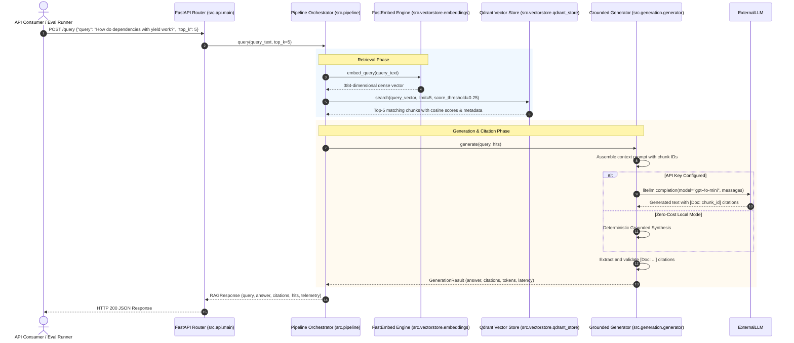

# Baseline RAG Pipeline - Architectural Deep-Dive

This document details the architectural decisions, internal component interactions, data structures, and mathematical rationale underlying the Baseline RAG Pipeline.

---

## 1. System Design Philosophy

The architecture adheres to five core engineering principles:

1. **Deterministic Reproducibility**: Given the same 200 documents, chunk IDs, vector points, and evaluation runs produce identical results.
2. **Minimal Footprint & Zero-Cost Execution**: Embeddings run locally via ONNX Runtime (`FastEmbed`), eliminating external API fees and network latency during ingestion and retrieval.
3. **Strict Citation Grounding**: The pipeline enforces attribution on every factual response (`[Doc: <chunk_id>]`) rather than generating ungrounded text.
4. **Clean Abstraction Boundaries**: Ingestion, vector storage, retrieval, and generation are decoupled via standard Python interfaces, enabling drop-in extensions for downstream projects.
5. **Measurable Baseline Telemetry**: Every query measures retrieval latency, generation latency, total latency, token count, and cost.

---

## 2. Component Interaction & Data Flow



---

## 3. Subsystem Architecture

### 3.1 Document Ingestion & Chunking

#### Chunking Sizing Rationale
- **Target Size**: 500 tokens ($\approx 375$ words). 
  - *Rationale*: Smaller chunks ($\approx 100$ tokens) lose broader context like function definitions and full code blocks. Larger chunks ($\approx 1000$ tokens) dilute embedding representations and reduce top-$k$ precision.
- **Overlap**: 50 tokens ($\approx 37$ words, $10\%$ overlap).
  - *Rationale*: Prevents information fragmentation across sentence and code boundaries.

#### Boundary Preservation
Rather than slicing by character count, `TokenAwareChunker` splits by:
1. Double newlines (markdown paragraphs).
2. Markdown headers (`## `, `### `).
3. Code blocks (preserving triple backtick fences).

#### Contextual Prefixing
Every chunk is prepended with its metadata:
```text
[FastAPI - Dependencies with Yield and Teardown Logic]
## Managing Lifecycles with Yield
A dependency with yield replaces try...finally resource managers...
```
This forces the dense embedding model to represent both the topical domain and the local content simultaneously.

---

### 3.2 Embedding Representation

- **Model**: `BAAI/bge-small-en-v1.5`
- **Dimensionality**: 384 dimensions.
- **Runtime**: ONNX Runtime via `fastembed`.
- **Distance Metric**: Cosine Similarity:
$$\text{Cosine}(u, v) = \frac{u \cdot v}{\|u\|_2 \|v\|_2}$$

Vectors are L2-normalized upon extraction, turning cosine distance into an optimized inner dot product inside Qdrant.

---

### 3.3 Vector Database & Payload Schema (Qdrant)

Points are indexed in Qdrant with deterministic UUIDs:
```python
point_id = str(uuid.uuid5(uuid.NAMESPACE_DNS, chunk.chunk_id))
```

#### Payload Index Schema:
| Field Name | Type | Purpose |
| :--- | :--- | :--- |
| `chunk_id` | `keyword` | Unique chunk identifier cited in responses |
| `doc_id` | `keyword` | Ground-truth source document identifier |
| `category` | `keyword` | Domain filter (`FastAPI`, `Scikit-Learn`, `MongoDB`) |
| `domain` | `keyword` | Sub-domain classifier |
| `token_count` | `integer` | Token length for cost and context budget tracking |
| `text` | `text` | Full chunk passage for prompt assembly |

This schema directly prepares the collection for **Project 2 (Permission-Aware Multi-Tenant RAG)**, where `tenant_id` and `allowed_roles` are indexed as keyword pre-filters.

---

### 3.4 Citation Grounding Protocol

To eliminate hallucinations, the generation engine enforces attribution:
1. Every claim must end with `[Doc: <chunk_id>]`.
2. A post-processing regex parses all citations:
   ```python
   re.findall(r"\[Doc:\s*([^\]]+)\]", text)
   ```
3. Citations are verified against the retrieved chunk IDs to compute **Citation Precision**.
